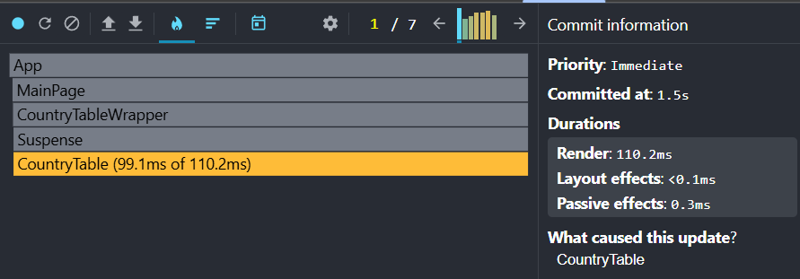
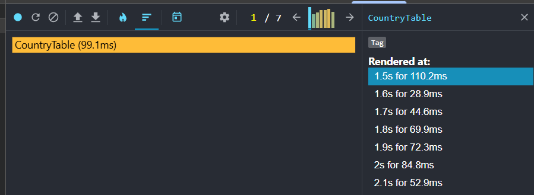
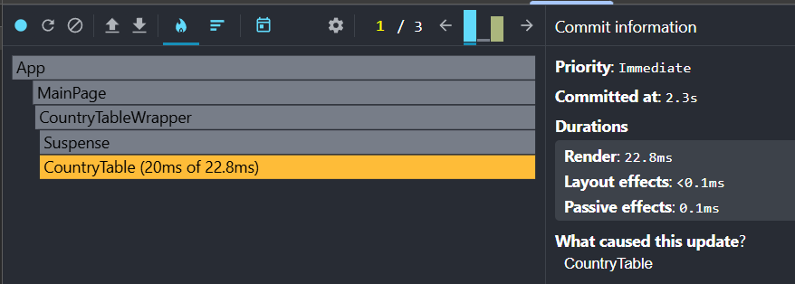
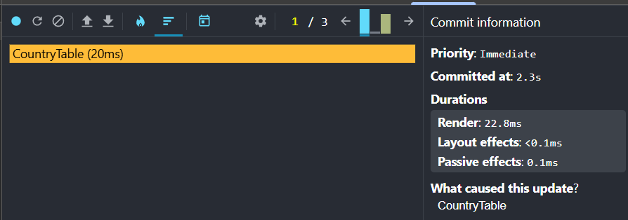
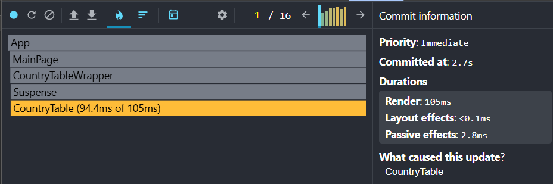
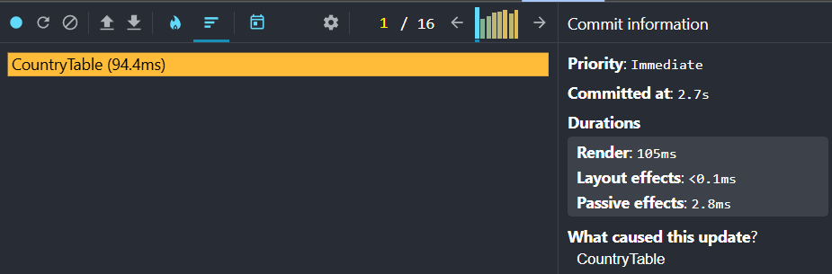
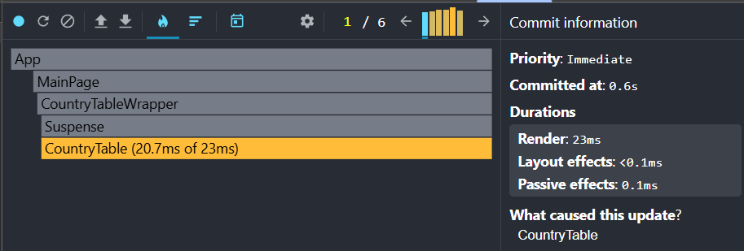
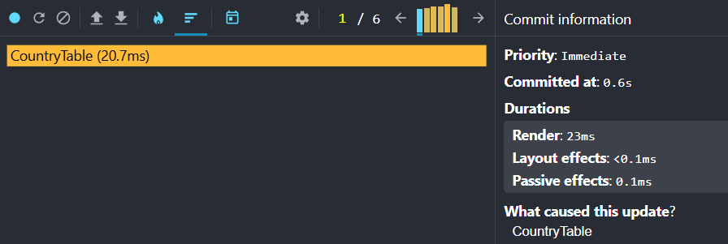

# My App

Climate Data Viewer

## Performance Profiling

Initial profiling was performed using **React DevTools Profiler**.

- **Tested interactions:**
  - Sorting a column
  - Searching for a country
  - Selecting a year
  - Adding/removing columns

## Before optimization

<!-- SORTING -->

### 1. Sorting a column: dsfsdf

- **Commit Duration: 1.5s**
- **Render Duration: 110.2ms**
- **Interactions:** Not recorded (Profiler did not capture explicit interactions, but commit and render times were analyzed instead)

### - Screenshots:

#### Flame Graph for sorting

#### Ranked Chart for sorting

<!-- SEARCHING -->

### 2. Searching for a country:

- **Commit Duration: 2.3s**
- **Render Duration: 22.8ms**
- **Interactions:** Not recorded (Profiler did not capture explicit interactions, but commit and render times were analyzed instead)

### - Screenshots:

#### Flame Graph for search

#### Ranked Chart for search

<!-- SELECTING YEAR  -->

### - Selecting a year:

- **Commit Duration: 2.7s**
- **Render Duration: 105ms**
- **Interactions:** Not recorded (Profiler did not capture explicit interactions, but commit and render times were analyzed instead)

### - Screenshots:

#### Flame Graph for year

#### Ranked Chart for year

<!-- ADDING REMOVING COLUMNS -->

### - Adding/removing columns:

- **Commit Duration: 0.6s**
- **Render Duration: 23ms**
- **Interactions:** Not recorded (Profiler did not capture explicit interactions, but commit and render times were analyzed instead)

### - Screenshots:

#### Flame Graph for columns

#### Ranked Chart for columns

